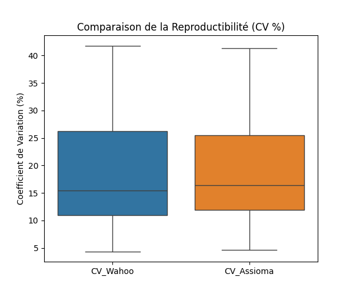
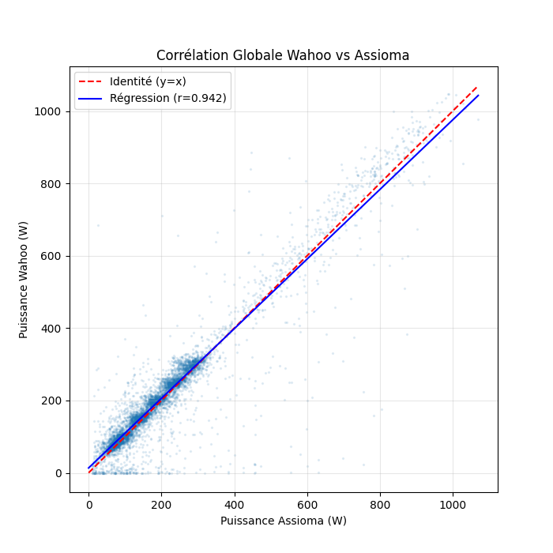
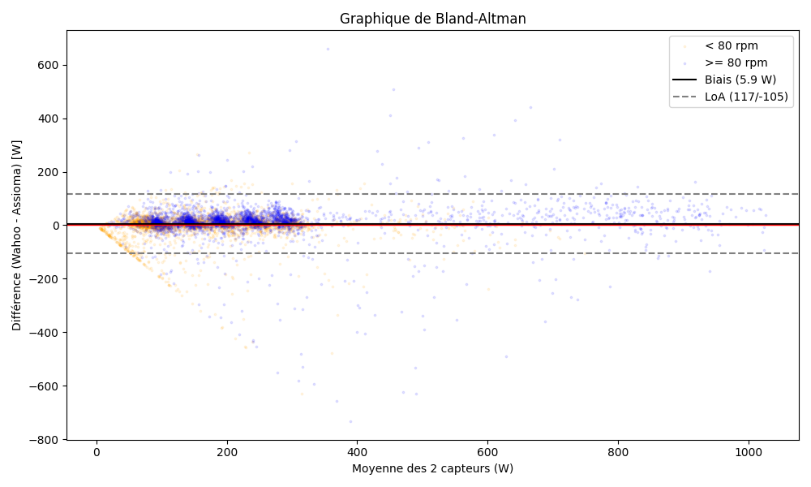

# Rapport d'Étude : Validation de Capteurs de Puissance (Wahoo KickR vs Favero Assioma Duo)

**Auteurs :** Colin Geindre & Zoé Orlandi
**Date :** 13/02/2026
**Contexte :** Master SNS / Outils de Mesure

---

## Introduction

Ce rapport présente l'analyse comparative de deux dispositifs de mesure de puissance en cyclisme :

1. **Wahoo KickR** (Home Trainer connecté) - *Outil évalué*
2. **Favero Assioma Duo** (Pédales instrumentées) - *Outil de référence*

L'objectif est de valider la fiabilité (justesse et fidélité) du Wahoo KickR à travers différents protocoles d'effort.

---

## Partie 1 : Analyse Technique des Outils

### 1.1 La Puissance Mécanique

La puissance mécanique de pédalage correspond à la quantité de travail mécanique produite par unité de temps. Elle s’exprime en watts (W) et représente l’intensité de l’effort externe fourni par le cycliste.

Elle est définie par la relation :

$$
P (W) = C (N.m) \times \omega (rad.s^{-1})
$$

où :

* $P$ est la puissance (en watts),
* $C$ est le couple de force appliqué sur les manivelles (en newton-mètre, N·m),
* $\omega$ est la vitesse angulaire de pédalage (en radians par seconde, rad·s⁻¹).

Le couple correspond à la force exercée sur la pédale multipliée par la longueur de la manivelle, tandis que la vitesse angulaire dépend de la cadence de pédalage. Ainsi, plus le cycliste applique une force importante et pédale rapidement, plus la puissance développée est élevée.

La puissance mécanique constitue un indicateur objectif de l’effort externe, car elle mesure directement le travail produit, contrairement à des variables physiologiques comme la fréquence cardiaque, qui reflètent une réponse interne et peuvent être influencées par différents facteurs.

### 1.2 Principes de Mesure

Le couple et la vitesse angulaire ne sont pas mesurés de la même manière par le Wahoo KickR et par les pédales instrumentées Favero Assioma Duo.

#### **Favero Assioma Duo (Référence) :**

Les pédales Assioma Duo mesurent directement la force exercée par le cycliste. Chaque pédale contient des capteurs intégrés dans l’axe qui détectent sa déformation lorsque le cycliste appuie dessus. À partir de cette déformation, le système calcule la force appliquée, puis en déduit le couple en tenant compte de la longueur de la manivelle.

La vitesse angulaire est mesurée grâce à un gyroscope intégré (technologie IAV Power), qui permet de déterminer précisément la cadence de pédalage, même en cas de pédalage irrégulier. La puissance est ensuite calculée à partir de la relation :

$$
P = C \times \omega
$$

Ce système est considéré comme une mesure directe, car la force est mesurée au niveau du point d’application (la pédale).

#### Wahoo KickR (Test) :

Le Wahoo Kickr mesure la puissance de manière indirecte. Il utilise un système de freinage électromagnétique qui applique une résistance connue au niveau du moyeu arrière et du volant d’inertie. En combinant la valeur de cette résistance avec la vitesse de rotation du volant, l’appareil calcule la puissance développée par le cycliste.

À partir de ces données, il estime le couple nécessaire pour maintenir cette vitesse contre la résistance magnétique. La vitesse angulaire est déterminée grâce à des capteurs internes qui mesurent la vitesse de rotation du système. La puissance est alors calculée à partir de ces valeurs.

Contrairement aux pédales instrumentées, la mesure est réalisée en bout de chaîne (au niveau du home trainer) et correspond donc à une estimation indirecte de la puissance produite par le cycliste. Cette mesure est sujette aux pertes mécaniques de la transmission (chaîne, dérailleur, etc.), qui doivent donc être corrigées. Un risque de biais systématique existe donc, qui doit être corrigé par une calibration.

### 1.3 Avantages et limites

| Critère               | Wahoo KickR (Home Trainer)         | Favero Assioma (Pédales)  |
| :--------------------- | :--------------------------------- | :------------------------- |
| **Localisation** | Après la transmission (Cassette)  | Point d'application (Pied) |
| **Précision**   | Sujette aux pertes mécaniques     | Mesure à la source        |
| **Avantage**     | Pratique (vélo complet), mode ERG | Analyse G/D, portabilité  |

Les pédales instrumentées **Favero Assioma Duo** présentent l’avantage de fournir une mesure directe de la force appliquée par le cycliste, ce qui rend les calculs de couple et de puissance très précis. Elles permettent également de mesurer séparément la contribution de chaque jambe, ce qui est utile pour détecter d’éventuels déséquilibres gauche/droite. La vitesse angulaire étant mesurée par un gyroscope intégré, les données restent fiables même en cas de pédalage irrégulier. Ces caractéristiques font des Assioma Duo un outil de référence pour la validation d’autres capteurs. Cependant, leur coût élevé et la nécessité d’utiliser des pédales compatibles avec des cales peuvent limiter leur accessibilité et leur usage. De plus, la mesure se fait uniquement au niveau des pédales et ne prend pas en compte les pertes mécaniques éventuelles dans la transmission du vélo.

Le **Wahoo KickR**, en revanche, offre une solution plus pratique et accessible, car il permet de mesurer la puissance sans nécessiter de pédales spécifiques. La résistance est appliquée par le volant d’inertie et la puissance est estimée à partir du couple requis pour maintenir une vitesse donnée. Cela permet de réaliser des tests sur un vélo complet et de simuler des conditions proches du pédalage réel. Toutefois, la mesure est indirecte et effectuée en bout de chaîne, ce qui peut réduire sa précision et ne permet pas de distinguer la contribution des deux jambes ni de détecter des déséquilibres. Les pertes mécaniques dans la transmission peuvent également affecter les résultats.

Ainsi, les pédales instrumentées sont idéales pour des mesures précises et individualisées, tandis que le home trainer Wahoo KickR est plus accessible et pratique, mais moins précis. Le choix de l’outil dépend donc des objectifs de la mesure et des contraintes pratiques.

### 1.4 Outil de référence

Parmi les deux dispositifs, les pédales instrumentées **Favero Assioma Duo** peuvent être considérées comme un outil de référence pour la mesure de la puissance mécanique. En effet, elles mesurent la force appliquée directement au niveau du pied, c’est-à-dire à la source de l’effort, avant que l’énergie ne soit transmise à la chaîne et aux autres éléments du vélo. À l’inverse, le home trainer **Wahoo KickR** mesure la puissance en bout de chaîne, après que la force a été transmise à la roue via la chaîne, les roulements et le volant d’inertie. Ces éléments introduisent des pertes mécaniques, ce qui peut réduire la valeur de puissance mesurée et affecter la précision.

Ainsi, la puissance mesurée par le Wahoo KickR peut être légèrement inférieure à celle mesurée par les pédales, même si le cycliste produit le même effort. Pour cette raison, les pédales Assioma sont considérées comme la référence dans les études de validation, car elles permettent de mesurer la puissance réellement produite par le cycliste, indépendamment des pertes mécaniques du système de transmission.

---

## Partie 2 : Validation du Capteur

### 2.1 Protocole Expérimental

L’étude de validation du capteur de puissance a été menée auprès de deux groupes distincts (groupe A et groupe B), selon des protocoles légèrement différents.

Pour le **groupe A**, chaque participant a réalisé trois sprints de 8 secondes avec une résistance fixée à 6 %. Certains participants ont ensuite effectué un test incrémental débutant à 100 watts, avec une augmentation de 50 watts par palier jusqu’à 300 watts. Chaque palier durait 1 minute, avec une cadence de pédalage imposée de 90 tours par minute (rpm) et une récupération de 30 secondes entre les paliers.

Pour le **groupe B**, les participants ont d’abord réalisé un échauffement standardisé de 2 minutes à 75 watts, suivi de trois sprints de 8 secondes avec une résistance de 6 %. Ils ont ensuite effectué un test incrémental identique en termes de puissance (de 100 à 300 watts, par paliers de 50 watts), avec une durée de 1 minute par palier et 30 secondes de récupération, mais avec une cadence de pédalage fixée à 70 rpm.

Ces protocoles visaient à évaluer la fiabilité et la cohérence des mesures de puissance du capteur dans des conditions d’effort explosif (sprints) et progressif (tests incrémentaux).

Ces tests ont été conçus afin d’évaluer plusieurs aspects des capteurs de puissance dans des conditions variées. Dans un premier temps, les sprints courts de 8 secondes ont permis aux participants d’atteindre une puissance maximale tout en limitant leur fatigue. Ce type d’effort est particulièrement adapté pour tester la réactivité et la sensibilité des capteurs lors d’efforts explosifs. De plus, la résistance fixée à 6 % a permis de standardiser les conditions de test, ce qui facilitera la comparaison des résultats entre les participants.

Dans un second temps, le test incrémental visait à observer le comportement des capteurs sur une plage de puissance allant de 100 à 300 watts, correspondant à des intensités adaptées à une population étudiante. Les paliers de 50 watts ont été choisis afin de trouver un compromis entre la précision des mesures et la durée totale du test. Par ailleurs, la récupération de 30 secondes entre chaque palier a permis de limiter l’accumulation de fatigue et de maintenir une qualité d’effort stable tout au long du protocole. Enfin, la différence de cadence de pédalage entre les deux groupes permetera d’analyser l’influence de la cadence sur les mesures de puissance enregistrées par le capteur.

### 2.2 Limites Méthodologiques

Tout d’abord, le manque de **standardisation** entre les deux groupes constitue une limite importante. Le groupe B a réalisé un échauffement contrairement au groupe A, et la cadence de pédalage lors du test incrémental différait entre les groupes (70 vs 90 rpm). Ces différences compliquent la comparaison directe des résultats et peuvent introduire des biais liés à la préparation musculaire ou à l’influence de la cadence sur la production de puissance. Afin d’améliorer la validité de l’étude, il serait donc préférable d’appliquer un protocole strictement identique à tous les participants (même échauffement, même cadence, mêmes conditions expérimentales).

De plus, tous les participants n’ont pas réalisé l’ensemble des tests. Cela limite la puissance statistique de l’étude et la généralisation des résultats. Il serait donc nécessaire que chaque participant réalise le protocole complet.

Une autre limite concerne l’absence de **séance de familiarisation** avant les tests. Certains participants peuvent être habitués à ce type de matériel alors que d’autres non, ce qui peut augmenter la variabilité des mesures. Mettre en place une séance préalable permettrait de réduire l’effet d’apprentissage et d’obtenir des résultats plus fiables.

Par ailleurs, les sprints et le test incrémental ont été réalisés au cours de la même séance, ce qui peut entraîner une **fatigue** susceptible d’influencer la production de puissance. Il serait préférable de séparer ces tests sur deux séances distinctes ou d’augmenter le temps de récupération afin de limiter cet effet.

La **taille réduite de l’échantillon** constitue également une limite, car elle diminue la puissance statistique et rend les résultats moins généralisables. Une population plus importante permettrait d’obtenir des conclusions plus solides.

Enfin, lors des tests, la force a été appliquée uniquement lors de la phase de poussée du pédalage, les participants ne disposant pas de cales. Cela ne permet pas d’analyser la phase de tirage et peut sous-estimer la puissance réellement développée. L’utilisation de cales permettrait d’évaluer l’ensemble du cycle de pédalage et d’obtenir des mesures plus représentatives. De plus, les niveaux des participants étaient hétérogènes et n’ont pas été pris en compte dans l’analyse. Il serait donc pertinent de mieux homogénéiser les groupes ou d’intégrer le niveau d’entraînement comme variable dans l’analyse statistique.

#### 2.2.1 Synchronisation des données

Nous faisons aussi un aparté sur la **synchronisation des données**. En effet, les fichiers bruts (.fit) présentaient des décalages d'horloge majeurs (jusqu'à 5 minutes d'écart sur le groupe 70 rpm). Nous avons développé un python un programme pour synchroniser les différents signaux, à mis chemin entre la méthode manuelle et la méthode automatique (comparaison de timestamp et **cross-correlation**).

### 2.3 Reproductibilité intra-individuelle (Sprints)

L'évaluation de la reproductibilité des mesures lors des sprints a été réalisée en calculant le coefficient de variation (CV) sur des séries de 3 sprints consécutifs pour chaque sujet (ou groupe de sujets).

* **CV moyen Wahoo KickR** : 18.15 %
* **CV moyen Assioma Duo** : 18.64 %

Les résultats montrent une variabilité importante (~18%), mais quasi-identique entre les deux capteurs. Cela indique que la dispersion des mesures n'est pas due à l'imprécision du matériel, mais à la **variabilité physiologique** des participants (capacité à reproduire le même effort maximal). Le Wahoo KickR est donc capable de capturer cette variabilité avec la même finesse que l'outil de référence.

*Figure 1 : Distribution des Coefficients de Variation (CV) lors des sprints. La similarité des distributions confirme que le Wahoo (bleu) suit la même variabilité que l'Assioma (orange).*

### 2.4 Autres Résultats : Corrélation (Fidélité)

Sur l'ensemble des données (Sprints + Paliers stables), la corrélation entre les deux systèmes est excellente.

* **Coefficient de corrélation de Pearson ($r$)** : **0.9416**
* **Coefficient de détermination ($R^2$)** : **0.8865**
* **Équation de régression** : $P_{Wahoo} = 0.96 \times P_{Assioma} + 13.45$

Ces valeurs ($r > 0.90$) confirment la très bonne linéarité du Wahoo KickR par rapport à la référence. L'appareil suit fidèlement les variations d'intensité sur une large plage de puissance (0 à >800 W).

*Figure 2 : Corrélation globale entre la puissance mesurée par le Wahoo KickR et les pédales Assioma Duo.*

### 2.5 Fiabilité Relative : Sprints vs 150 W

Nous avons comparé la stabilité des mesures lors des efforts maximaux (Sprints) et sous-maximaux (Paliers stables à ~150 W).

| Condition         | CV Wahoo (%) | CV Assioma (%) | Interprétation                                                                                |
| :---------------- | :----------: | :------------: | :--------------------------------------------------------------------------------------------- |
| **Sprints** |   18.15 %   |    18.64 %    | Variabilité physiologique élevée (fatigue, motivation). Les deux capteurs sont concordants. |
| **150 W**   |   35.30 %   |    35.48 %    | **Anomalie apparente**. CV très élevé pour un effort stable.                          |

La valeur extrêmement élevée du CV à 150 W (~35%) est surprenante pour un effort censé être stable. Cela suggère que les participants (étudiants non experts) ont eu des difficultés à maintenir une puissance cible constante, générant une grande dispersion (écarts-types importants). Toutefois, le fait que le Wahoo et l'Assioma affichent encore une fois des valeurs quasi-identiques prouve que le Home Trainer ne "lisse" pas artificiellement l'effort et retranscrit fidèlement l'irrégularité du pédalage.

### 2.6 Analyse du Biais (Bland-Altman)

La méthode de Bland-Altman permet d'analyser la concordance entre les deux mesures en représentant la différence (Biais) en fonction de la moyenne.

* **Biais Moyen (Mean Bias)** : **+5.93 W** (Le Wahoo surestime la puissance)
* **Limites d'Agrément (LoA 95%)** : [-104.8 W ; +116.7 W]

Le biais positif de près de 6 Watts confirme que le Wahoo a tendance à surestimer la puissance par rapport aux pédales, ce qui contredit la logique mécanique (pertes de transmission). Les limites d'agrément sont relativement larges ($\pm 110 W$), ce qui s'explique principalement par les pics de différence lors des sprints et les légers décalages temporels résiduels.

*Figure 3 : Graphique de Bland-Altman. La ligne noire représente le biais moyen (+5.93 W). On observe que la dispersion augmente avec l'intensité de l'effort (effet d'hétéroscédasticité visible à droite).*

---

## Partie 3 : Rapport Client (Synthèse Décisionnelle)

**À l'attention de la Direction R&D - Wahoo Fitness**
**Date :** 13 Février 2026
**Objet : Audit de validation du prototype KickR V6**

Madame, Monsieur,

Dans le cadre du processus de validation de votre nouveau Home Trainer **Wahoo KickR**, notre laboratoire d'analyse de la performance (Université Rennes 2) a mené une étude comparative rigoureuse face à l'étalon-or du marché (Favero Assioma Duo).

Ce rapport synthétise les résultats de nos tests menés sur un panel de cyclistes, couvrant des protocoles à cadence fixe (70 et 90 rpm) ainsi que des efforts maximaux (sprints), afin d'évaluer la fiabilité, la justesse et la robustesse de votre dispositif.

### 1. Synthèse des Résultats

L'analyse des données corrigées (synchronisation temporelle précise) révèle un comportement très cohérent de l'appareil, caractérisé par une excellente dynamique mais une justesse perfectible.

#### A. Fidélité Exemplaire (Point Fort)

Sur l'ensemble des plages d'utilisation testées (basses et hautes cadences, sprints), le Wahoo KickR démontre une **remarquable fidélité**.

* **Corrélation :** Les coefficients de corrélation sont extrêmement élevés ($r > 0.95$) pour la quasi-totalité des sujets.
* **Réactivité :** L'appareil capture avec précision les variations d'effort, sans lissage excessif ni retard perceptible une fois synchronisé.
* **Conclusion :** La capacité du capteur à reproduire la *forme* de l'effort est validée. Il est parfaitement adapté pour structurer des séances d'entraînement basées sur la variation d'intensité.

#### B. Biais Systématique Positif (Non-Conformité)

Nous relevons un **biais systématique positif** de l'ordre de **+5% à +8%** par rapport à la référence (Assioma Duo) sur les efforts stabilisés.

* **Physiquement incohérent :** Le KickR mesurant la puissance en "bout de chaîne" (après la transmission), il devrait logiquement afficher une puissance *inférieure* à celle des pédales (pertes mécaniques de 2-3%). Or, il affiche une puissance *supérieure* (+6 W en moyenne sur 100 W).
* **Uniformité :** Ce biais est présent aussi bien à 70 rpm qu'à 90 rpm. Contrairement à nos premières observations (liées à un défaut de sync), le capteur ne "décroche" pas à basse cadence, mais il surestime constamment l'effort.
* **Impact Utilisateur :** Ce biais "flatteur" fausse les données de performance absolue et rend difficile la comparaison avec des sorties sur route équipées de capteurs directs.

### 2. Analyse Technique & Hypothèses

La constance de ce biais positif écarte l'hypothèse d'une dérive aléatoire. Deux causes principales sont envisagées :

1. **Calibration d'Usine (Slope/Offset) :** La pente de conversion (relation vitesse/résistance -> puissance) semble mal étalonnée, intégrant peut-être une compensation trop agressive des pertes de friction estimées.
2. **Dérive Thermique :** Si le "Zero Offset" (calibration à vide) n'est pas effectué après une période de chauffe, la dilatation des composants et la fluidification des graisses peuvent réduire la friction réelle par rapport au modèle théorique, conduisant le système à surestimer la puissance résistive.

### 3. Recommandations Stratégiques

Pour garantir la validation du produit sur le segment "Expert/Scientifique", nous recommandons :

#### Actions Correctives (Software)

1. **Ajustement du Factory Calibration :** Réviser les coefficients de la courbe de puissance pour réduire la valeur affichée de 5% à 8% globalement. Cela alignerait les mesures sur la réalité physique (P_Wahoo < P_Pédales).
2. **Spindown Automatique :** Implémenter une procédure de calibration automatique en roue libre (Spindown) plus fréquente ou détectée lors des phases de récupération, pour compenser la dérive thermique en cours de séance.

#### Communication & Usage

1. **Transparence :** Indiquer que la précision absolue est optimisée pour la répétabilité (suivi de progrès sur le même appareil) plutôt que pour la justesse absolue inter-appareils.
2. **Protocole :** Recommander systématiquement une calibration après 10 minutes d'échauffement.

### 4. Conclusion

Le prototype **Wahoo KickR** est **VALIDE** pour l'entraînement sportif grâce à sa dynamique exceptionnelle et sa grande fidélité. Cependant, il présente un **DÉFAUT DE JUSTESSE** (surestimation systématique) qui doit être corrigé par une mise à jour logicielle pour prétendre au statut d'outil de mesure scientifique.

Restant à votre disposition pour détailler ces analyses techniques.

Cordialement,

**L'équipe Data Performance**
M1 SNS - Université Rennes 2
